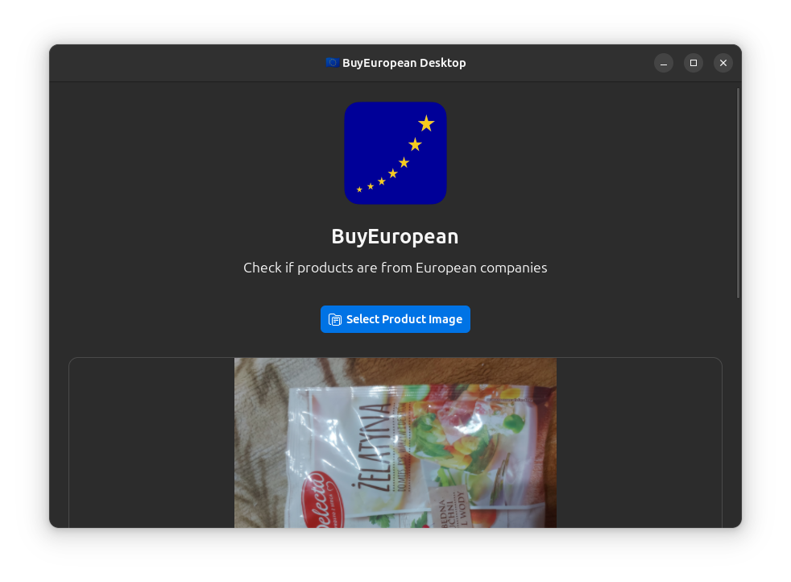
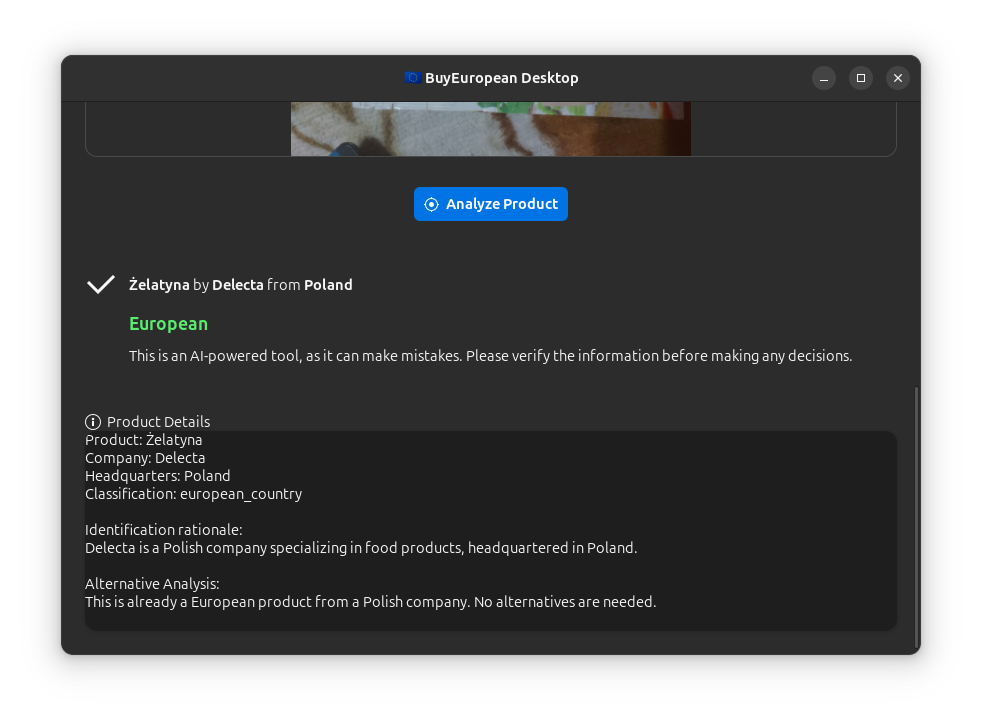
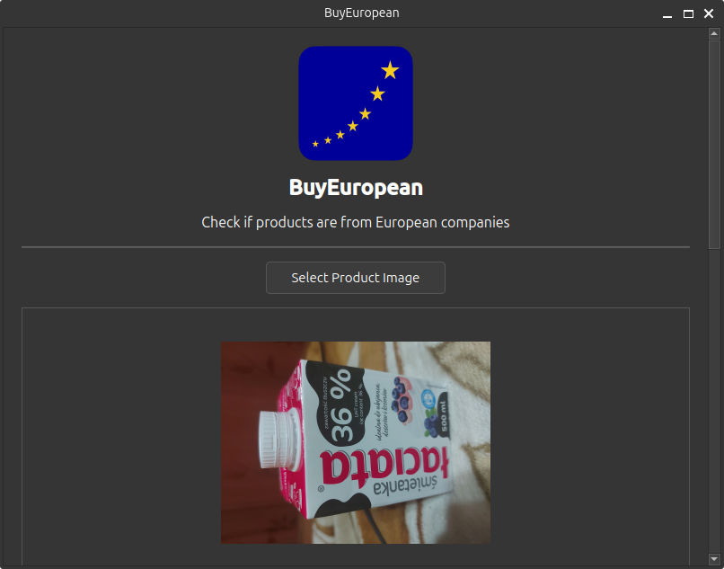
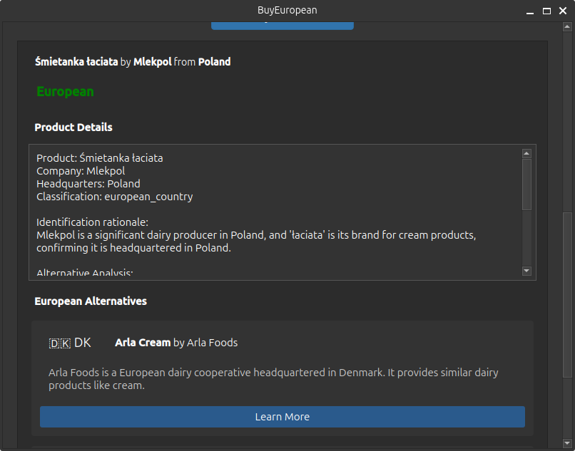
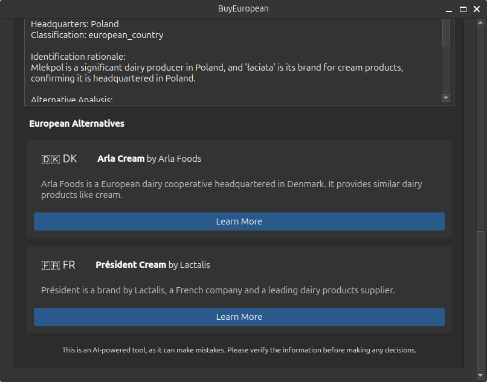

# BuyEuropean Desktop

A unofficial desktop client for the [BuyEuropean](https://buyeuropean.io/) API to analyze product images and determine if they're from European companies.

#### GTK4 frontend



#### Qt 6 frontend




## Disclaimer

This is an **unofficial desktop client** for the BuyEuropean API and is **not affiliated with the BuyEuropean project**.  
The BuyEuropean API is a free service that uses 3 AI models in parallel (Mistral, Gemini and GPT-o3-mini) to analyze product images and determine if they're from European companies.  
By using this desktop client or the BuyEuropean official native clients for Android and iOS, you agree to the [BuyEuropean terms and conditions](https://buyeuropean.io/terms) and [BuyEuropean privacy policy](https://buyeuropean.io/privacy-policy). 

## Features

- Upload product images for analysis
- Get detailed information about the product's origin (though it's not always accurate due it being processed by an AI model)
- See European alternatives for non-European products
- See the product's classification and rationale for the classification
- Send feedback (e.g. wrong classification) about the product's classification to the BuyEuropean API
- Sound effects for success and error notifications
- Debugging information display (token counts, request IDs)
- Adaptive UI that uses GTK 4 on Linux/Windows and Qt 6 on macOS/Android which can be set with command line flags

## Installation from source

### Requirements

- Python 3.9 or higher
- For Linux/Windows (or for users wanting to use the program with the GTK4 frontend): GTK 4.0 libraries and PyGObject
- For macOS/Android (or for users wanting to use the program with the Qt6 frontend): Qt 6 libraries and PyQt6

### Installing GTK 4 (Linux/Windows)

#### Ubuntu/Debian
```bash
sudo apt install libgtk-4-dev python3-gi python3-gi-cairo gir1.2-gtk-4.0
```

#### Fedora
```bash
sudo dnf install gtk4-devel python3-gobject python3-cairo-devel
```

#### Arch Linux
```bash
sudo pacman -S gtk4 python-gobject cairo
```

#### Windows
Install GTK 4 using MSYS2 (https://www.msys2.org/) and then install PyGObject as seen below:

```bash
pacman -S mingw-w64-x86_64-gtk4 mingw-w64-x86_64-python-gobject mingw-w64-x86_64-cairo
```   

### Installing Qt 6 (macOS/Android)

#### macOS
```bash
brew install qt6
pip install PyQt6
```

### Installing Qt 6 (Linux/Windows, alternative UI frontend)
```bash
pip install PyQt6
```

### Installing BuyEuropean Desktop

```bash
git clone https://github.com/matu6968/buyeuropean-desktop.git
cd buyeuropean-desktop
pip install -e .
```

### Installation via downloading the latest release

You can download the latest release from the GitHub Releases page and use it that way: https://github.com/matu6968/buyeuropean-desktop/releases

## Usage

After installation, you can run the application with:

```bash
buyeuropean
```

Or you can also run it with:

```bash
python -m buyeuropean
```

### Command-Line Options

The application supports the following command-line options:

- `--gtk4`: Force the application to use the GTK4 frontend, regardless of the platform 
(keep in mind that GTK 4 is only supported on Windows and Linux so it won't work on other platforms)
- `--qt6`: Force the application to use the Qt6 frontend, regardless of the platform
(this should only be used if the GTK4 frontend is not working or you want to use the Qt 6 frontend on DE's like KDE for better integration)

For example:

```bash
# Force GTK4 frontend
buyeuropean --gtk4

# Force Qt6 frontend
buyeuropean --qt6
```

## How it works

1. The application automatically selects the appropriate UI toolkit (GTK 4 or Qt 6) based on your platform (or with command line flags if requested)
2. You can upload a product image through the UI
3. The image is converted to base64 and sent to the BuyEuropean API
4. The API analyzes the image and returns information about the product's origin (likely the API uses GPT-4o as the model to process the image)
5. Sound effects play based on the product's classification:
   - Success sound for European or European Ally products
   - Error sound for European Sceptic products or errors
6. If the product is from a non-European company, the API suggests European alternatives
7. Debugging information shows token usage and request details (this info is only relevant for developers of the API)

## Sound Effects

The application plays sound effects based on product classification:

- Success sound (`sounds/success.ogg` or `sounds/success.wav`) - Played for European or European Ally products
- Error sound (`sounds/error.ogg` or `sounds/error.wav`) - Played for European Sceptic products or when errors occur

The application supports both OGG and WAV audio formats. The GTK4 frontend uses GStreamer for enhanced sound playback with better format compatibility.
**Note that on the Qt 6 frontend, only WAV format is supported due to limitations of the Qt Multimedia library.**

You can replace these sound files with your own OGG or WAV format files during building the application.

## License

#### The BuyEuropean name and logo are properties of Felix Graeber.
Everything else is under the MIT license.

## Packaging with Briefcase

You can create a standalone executable for the BuyEuropean desktop application using Briefcase, and picked due to it being far more convenient and easier to manage dependencies than using PyInstaller.

### Prerequisites

- Briefcase (`pip install briefcase`)
- Docker (optional, only needed if you want to build the application for a specific platform version)

### Building the Package

```bash
briefcase build
```

This will build the application for the current platform (based off the current host platform) and create a distributable package.

If you want to target a specific package type, you can use the `--packaging-format` flag.

```bash
briefcase build --packaging-format deb
```

Additionaly, if you want to target a specific platform version, you can use the `--target` flag.

```bash
briefcase build --target ubuntu:jammy
```

This will build the application using a Ubuntu 22.04 (Jammy Jellyfish) Docker container.

### Troubleshooting

If you encounter issues with the packaged application:

1. **Missing dependencies**: Install any missing Python packages and rebuild.

2. **Missing assets**: Check if the `sounds` and `logos` directories are present in the package.

3. **UI Backend issues**: The package will include both GTK and Qt backends. If one fails, it will try to use the other.

4. **GLib-GObject errors**: These are usually harmless warnings from Qt and can be ignored.
